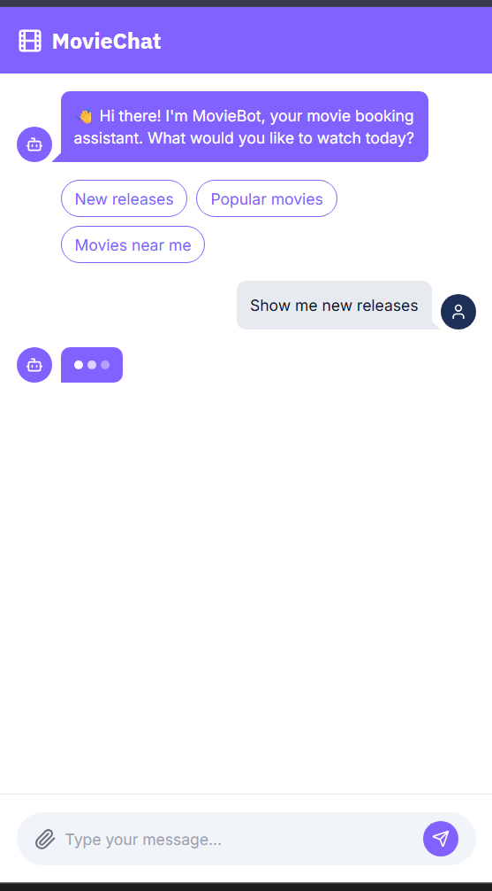
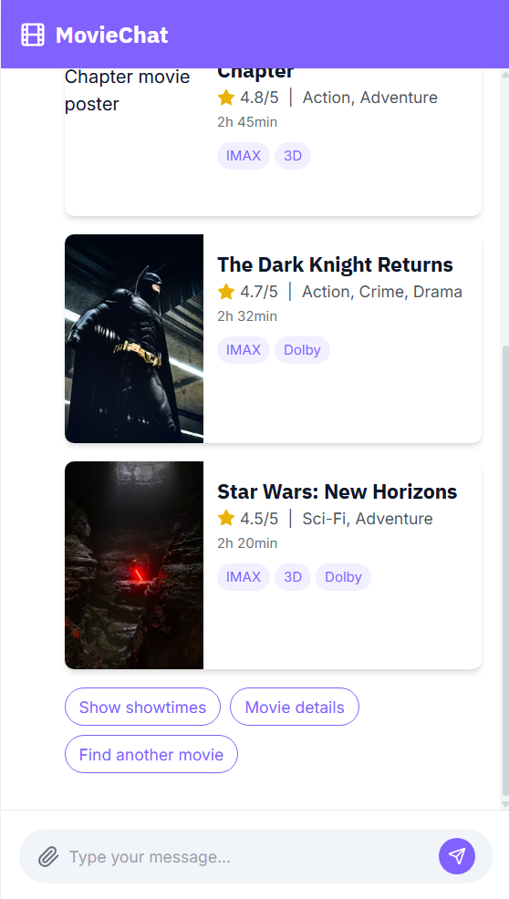
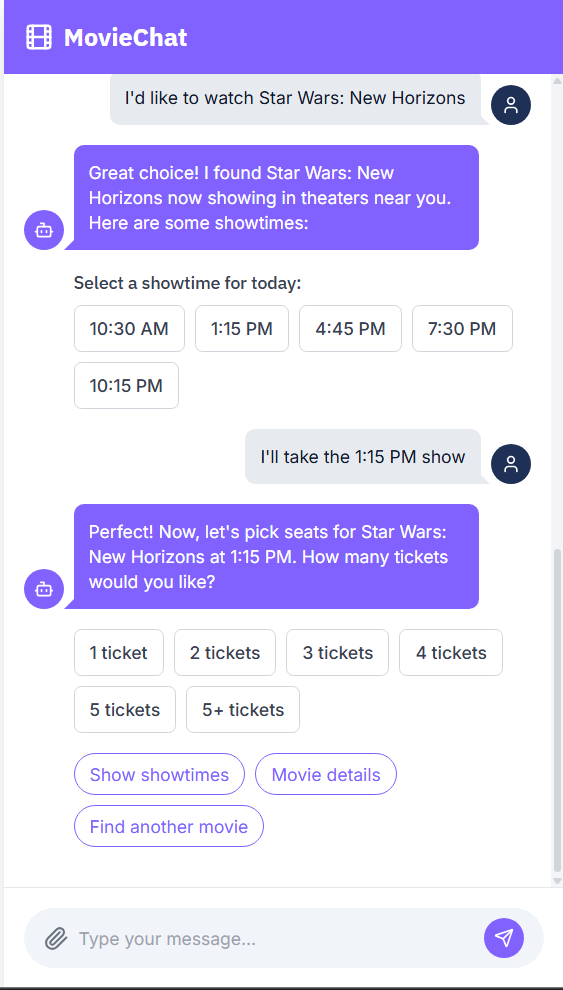
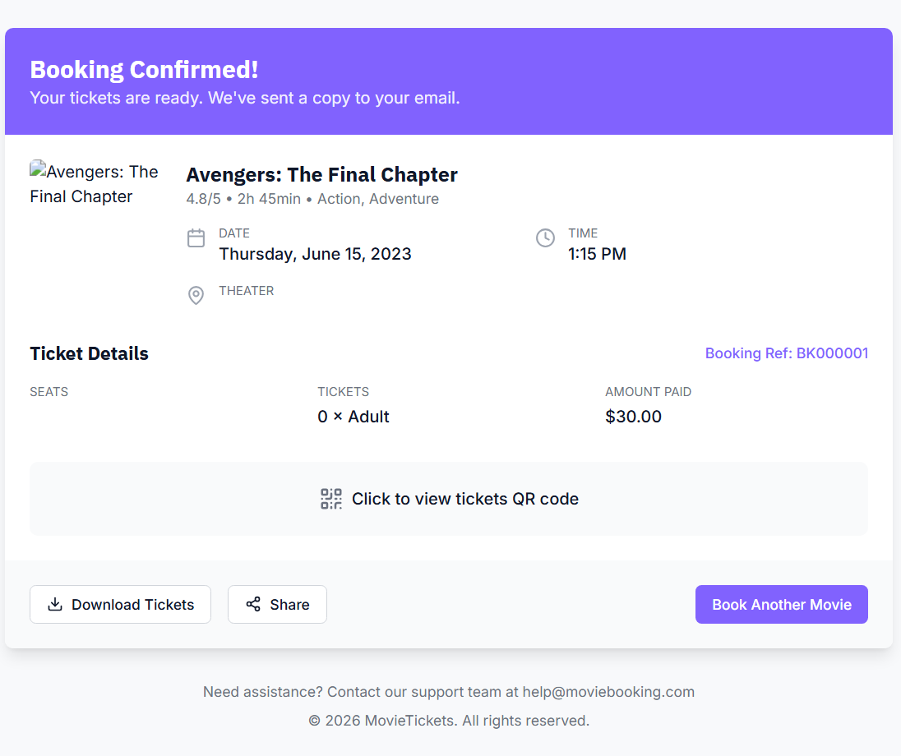

# Movie Booking Chatbot

A conversational movie ticket booking web application that allows users to discover movies, select showtimes, reserve seats, and generate a digital ticket through a chat interface.

## Application Preview

### Chat Interface

  

### Movie Discovery

  

### Timing Selection

  

### Seat Selection

  

### Ticket Confirmation

  

## Features
- Natural language chat interface for movie queries
- Browse new releases and popular movies
- Theater and showtime selection
- Interactive seat booking system
- Booking confirmation with QR code ticket

## Tech Stack
- Frontend: React + Vite + TailwindCSS
- Backend: Node.js + Express
- Language: TypeScript / JavaScript
- API Communication: REST APIs

## Running Locally

1. Install Node.js (v20 recommended)

2. Install dependencies
   npm install

3. Start backend server
   npx tsx server/index.ts

4. Start frontend
   npx vite

5. Open in browser
   http://localhost:5173

## Project Structure
client/ → React frontend (chat UI)  
server/ → Express backend (APIs & booking logic)  
shared/ → shared schemas and types
